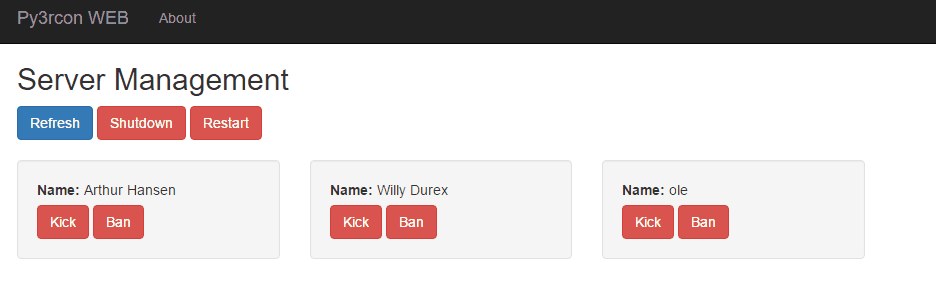

# py3rcon
Version: 0.2.2 | Authors: indepth666 (Basic protocol design), ole1986 (CLI)

py3rcon is a Python3 client for Battleye Rcon protocol. 
It's designed with ARMA2 and ARMA3 in mind but may also work with other implemenation of the protocol.

## Command arguments

<pre>Usage: ./py3rcon.py [-g | --gui] [-w | --web] &lt;configfile&gt;</pre>

**PLEASE NOTE:** 
Since version 1.58.1* of Arma 3 it is REQUIRED to add the line `RConPort <port>` into the beserver.cfg 
Otherwise Rcon will possible not work.

## Configuration

The configuration is stored in JSON format and usually does not support comments. 
A example can be found in `configexample.json`

Config entry            | Example        | Description
----------------------- | -------------- | -----------
logfile                 | pyrcon.log     | File name of the pyrcon log
loglevel                | 10             | Loglevel (10 = show debug info, 20 = exclude debug info, 30 = display only error and warnings)
server : host           | 127.0.0.1      | Hostname of the armaX server
server : port           | 2402           | Port of the armaX server
server : rcon_password  | yourPW         | Rcon password
commands                | commands.json  | Commands configuration file in JSON format (rconcommand module)
whitelist               | whitelist.json | stores the whitelisted players used by rconwhitelist module
restart : interval      | 240            | Restart interval in minutes
restart : delay         | 15             | Wait x seconds until shutdown after players have been kicked
restart : exitonrestart | true           | End the application when restart interval has reached

## Command GUI

Display a command line GUI using ncurses

**PLEASE NOTE (windows only):** 
To run the py3rcon GUI on WINDOWS an unofficial version of curses is REQUIRED: 
Download Link: http://www.lfd.uci.edu/~gohlke/pythonlibs/#curses

**PLEASE NOTE:**  
When using the `--gui|-g` argument, the **repeating** and **restart** module becomes disabled

<pre>Usage: ./py3rcon.py --gui &lt;configfile&gt;</pre>

<pre>
#---------------------------# #-------------------------------------------------------------------------------#
| Refresh Players           | |                                                                               |
| Manage Whitelist          | |                                                                               |
| Restart Mission...        | |                                                                               |
| Kick All                  | |                                                                               |
| Shutdown Server           | |                                                                               |
| Restart Server (v1.65)    | |                                                                               |
| Exit                      | |                                                                               |
|                           | |                                                                               |
#---------------------------# #-------------------------------------------------------------------------------#
#-  Enter command --------------------------------------------------------------------------------------------#
|                                                                                                             |
#-------------------------------------------------------------------------------------------------------------#
#-------------------------------------------------------------------------------------------------------------#
| 2016-12-01 21:20:11,927 INFO [Server: xxxxxxxxxxx.xx:10501]: Authenticated                                  |
| 2016-12-01 21:20:11,986 INFO [Server: xxxxxxxxxxx.xx:10501]: RCon admin #0 (xx.xx0.xx1.97:54410) logged in  |
| 2016-12-01 21:20:12,018 INFO [Server: xxxxxxxxxxx.xx:10501]: Players on server:                             |
| [#] [IP Address]:[Port] [Ping] [GUID] [Name]                                                                |
| --------------------------------------------------                                                          |
| (0 players in total)                                                                                        |
#-------------------------------------------------------------------------------------------------------------#
</pre>

## WEBSERVER
The webserver module requires Python 3 or higher

Run py3rcon as webserver which will be available on http://localhost:8000 (by default)

**PLEASE NOTE:** 
When using the `--web|-w` argument, the **repeating** and **restart** module becomes disabled

<pre>Usage: ./py3rcon.py --web &lt;configfile&gt;</pre>

